# Практическая работа №1  
## Консольные средства настройки сетевых компонентов в ОС Windows (Windows 10)

## 1. Проверка компонентов сетевого подключения

Открытие окна сетевых подключений:
`Win + R → ncpa.cpl → Enter → ПКМ по активному подключению → Свойства`

Проверены компоненты:

- Клиент для сетей Microsoft  
- Служба доступа к файлам и принтерам Microsoft  
- Протокол Интернета версии 4 (TCP/IPv4)

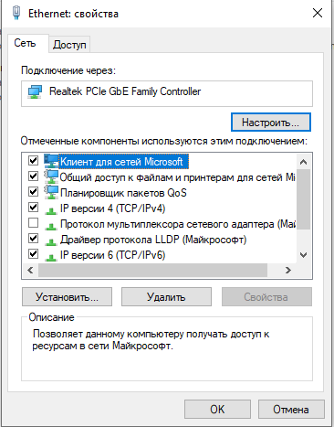

### Запрет доступа по SMB

Отключена служба:
- «Служба доступа к файлам и принтерам Microsoft»

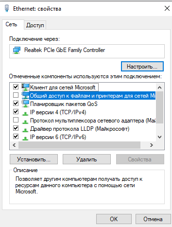

## 2. Использование утилиты ping

Выполненные команды:

```
ping google.com
```

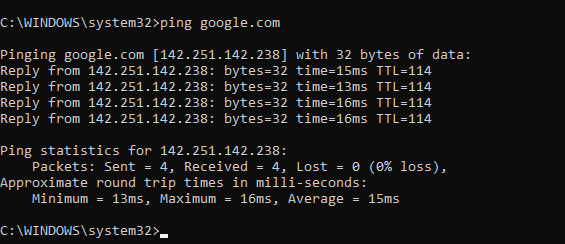

```
ping -n 5 google.com
```

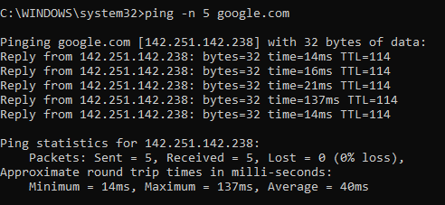

```
ping -l 1000 google.com
```

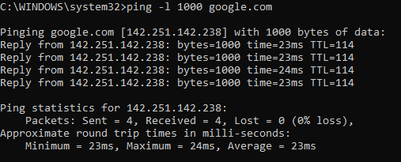

```
ping -t google.com
```

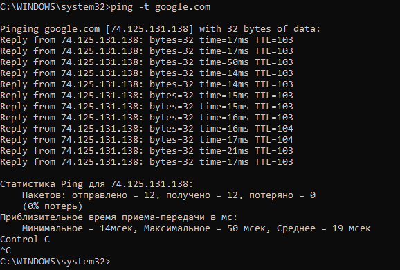

```
ping -n 5 google.com > C:\ping_results.txt
```

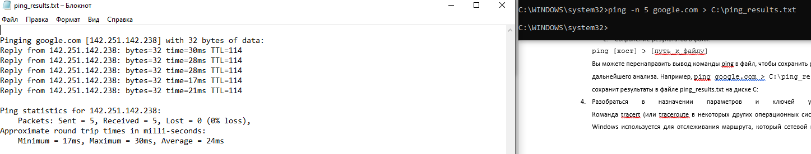

## 3. Использование утилиты tracert

```
tracert google.com
```

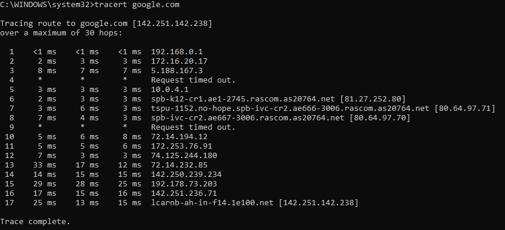

```
tracert -h 10 google.com
```

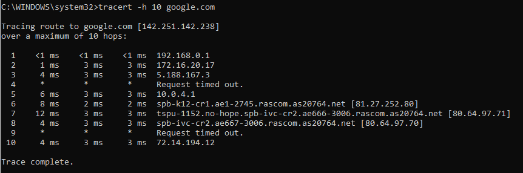

```
tracert -w 2000 google.com
```

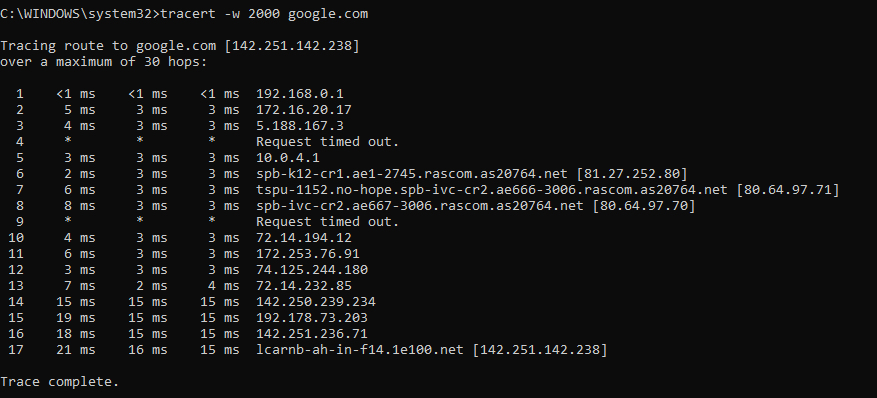

## 4. Использование ipconfig

```
ipconfig
```

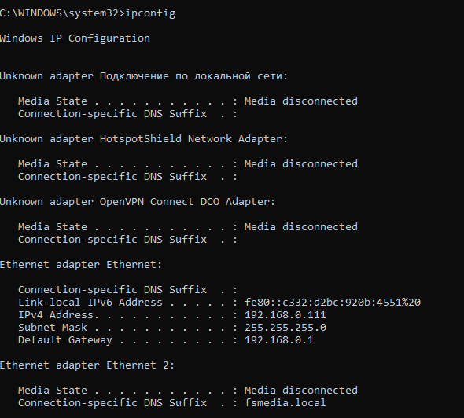

```
ipconfig /all
```

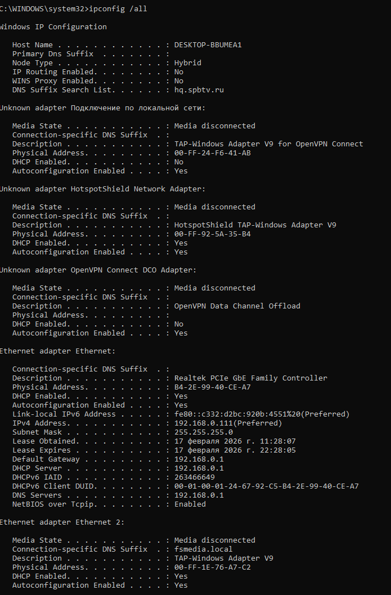

```
ipconfig /flushdns
```

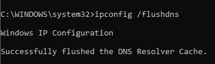

```
ipconfig /release
```

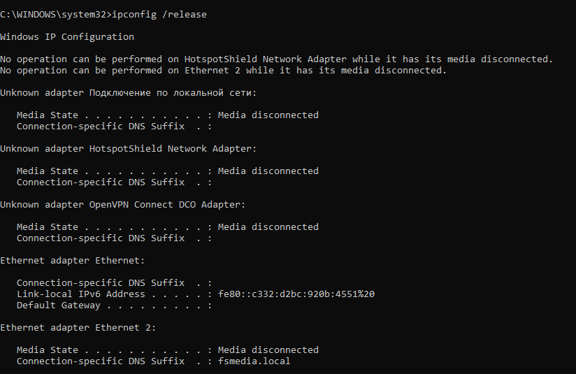

```
ipconfig /renew
```

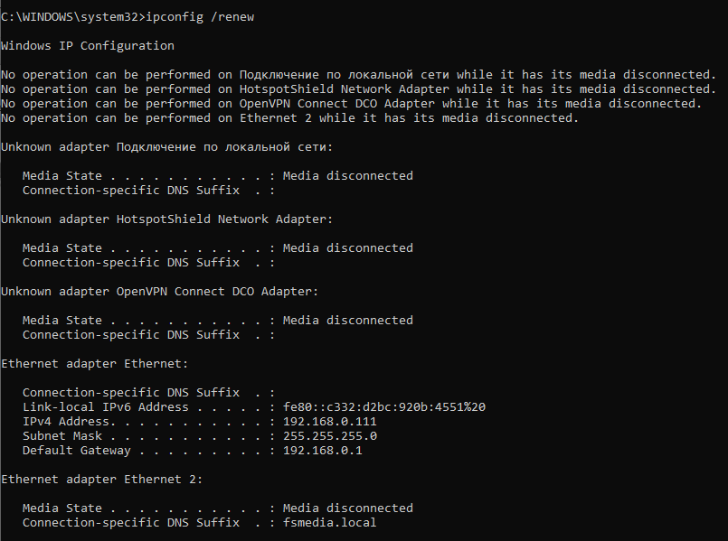

## 5. Использование команды net

```
net view
```

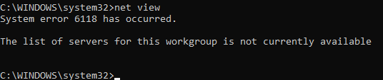

```
net share
```

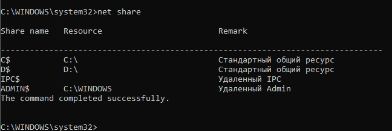

```
net user
```

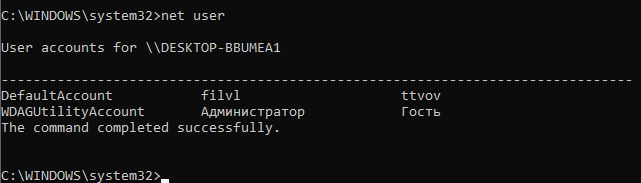

```
net localgroup
```

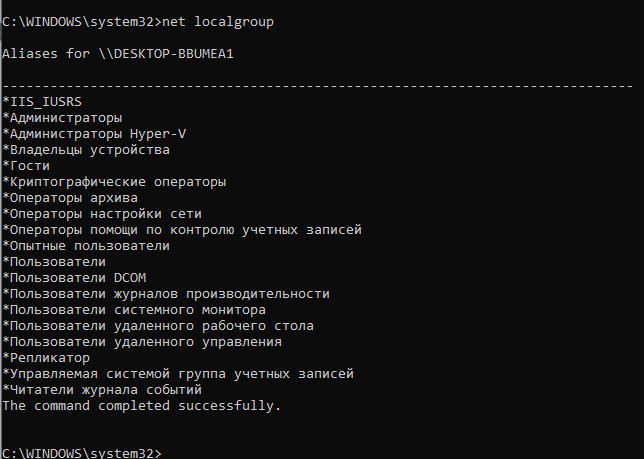

```
net statistics workstation
```

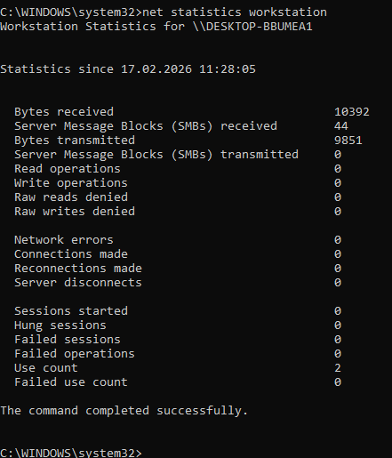

```
net use R: \SRV\TEST
```

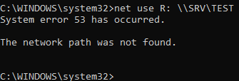

## 6. Использование netsh

```
netsh interface show interface
```

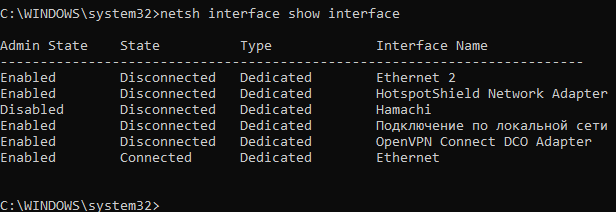

### Режим DHCP

```
netsh interface ip set address name="Ethernet" source=dhcp
netsh interface ip set dns name="Ethernet" source=dhcp
```

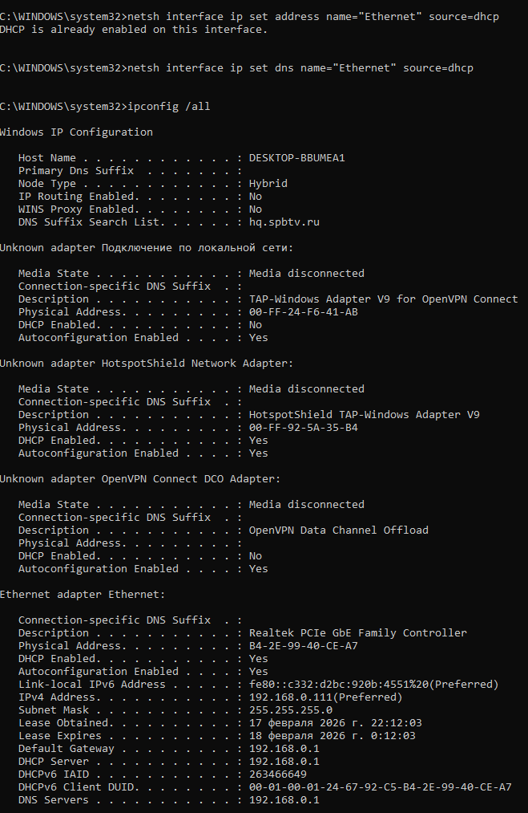

### Статический IP

```
netsh interface ip set address name="Ethernet" static 192.168.0.111 255.255.255.0 192.168.0.1
netsh interface ip set dns name="Ethernet" static 192.168.0.1
```

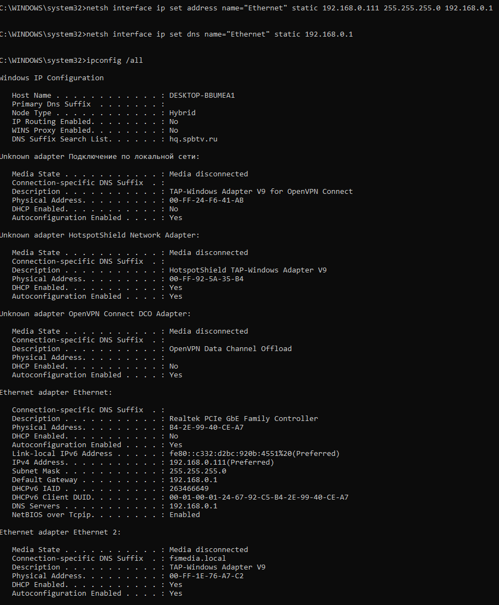

---

# Ответы на вопросы

## Как запретить доступ через GUI?
Снять галочку «Служба доступа к файлам и принтерам Microsoft» в свойствах сетевого подключения.

## Как запретить доступ к ресурсам других ПК?
Снять галочку «Клиент для сетей Microsoft».

## Как узнать DNS?
Команда:
```
ipconfig /all
```

## Назначение net use
Подключение сетевых ресурсов:
```
net use R: \SRV\TEST
```

## Переименование интерфейса в PowerShell
```
Rename-NetAdapter -Name "Ethernet" -NewName "MyNet"
```

## Режимы duplex
- Half-duplex — передача или прием по очереди  
- Full-duplex — одновременная передача и прием  

## Вывод

В ходе работы были изучены консольные утилиты Windows для диагностики и настройки сети, выполнены проверки доступности узлов, определён маршрут передачи пакетов, исследованы параметры IP-конфигурации и произведена настройка интерфейса в режимах DHCP и статической адресации.
