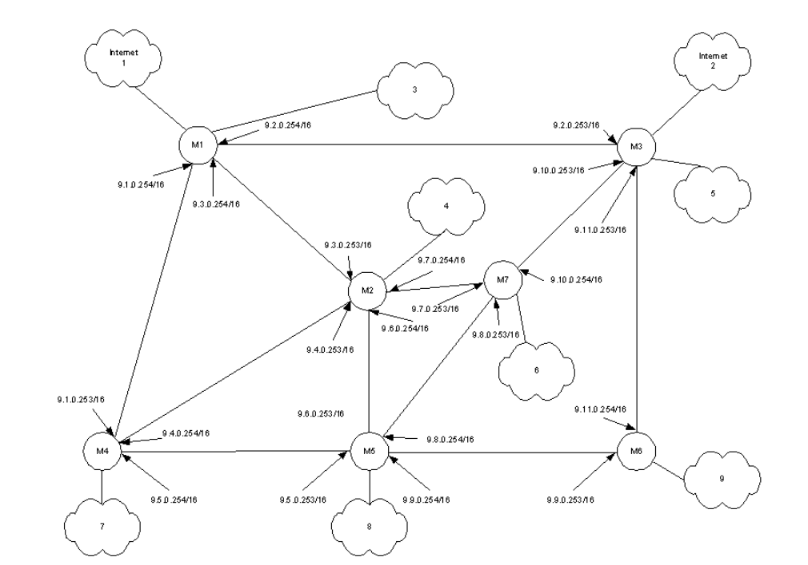
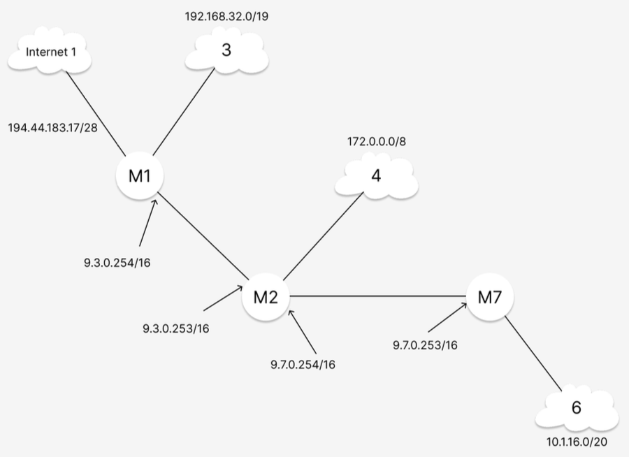
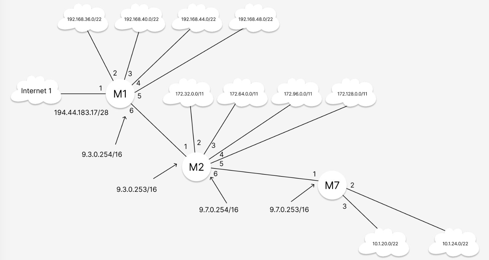

# ЛАБОРАТОРНАЯ РАБОТА №2
## Изучение общих принципов построения IP‑сетей (адресация и маршрутизация)

## ВВЕДЕНИЕ

Целью данной лабораторной работы является изучение принципов IP‑адресации, методов разбиения сетей на подсети, а также освоение базовых принципов маршрутизации в IP‑сетях. 
В рамках выполнения задания необходимо:

- выполнить математические расчёты подсетей;
- определить сетевые адреса и широковещательные адреса;
- вычислить диапазоны допустимых IP‑адресов хостов;
- назначить IP‑адреса интерфейсам маршрутизаторов;
- сформировать таблицы маршрутизации;
- реализовать сеть в симуляторе Cisco Packet Tracer;
- проверить корректность функционирования сети.

Исходная схема корпоративной сети приведена ниже.


*Описание: исходная схема корпоративной сети согласно методическим указаниям.*

# 1. СХЕМА ВАРИАНТА 10

Согласно варианту №10 используются маршрутизаторы 1, 2 и 7, а также сети 1, 3 (4 подсети), 4 (4 подсети) и 6 (2 подсети).

## Таблица 1.1 — Параметры варианта

| № варианта | Номера маршрутизаторов | Номера сетей |
|------------|------------------------|--------------|
| 10 | 1, 2, 7 | 1, 3(4), 4(4), 6(2) |

## Таблица 1.2 — IP‑адреса используемых сетей

| Сеть | IP‑адрес |
|------|-----------|
| 1 | 194.44.183.17/28 |
| 3 | 192.168.32.0/19 |
| 4 | 172.0.0.0/8 |
| 6 | 10.1.16.0/20 |

IP‑адрес интерфейса маршрутизатора М1 в сети Internet: **194.44.183.18/28**.


*Описание: выделенные сети и маршрутизаторы, соответствующие варианту 10.*

# 2. РАЗБИВКА СЕТЕЙ НА ПОДСЕТИ

## 2.1 СЕТЬ 3 — 192.168.32.0/19

Исходная маска сети:
/19 → 255.255.224.0  
Двоичное представление маски:
11111111.11111111.11100000.00000000

Необходимо получить 4 подсети.

### Определение количества дополнительных бит

Количество подсетей определяется формулой:

2^n ≥ 4

n = 2 (так как 2² = 4)

С учётом условия исключения нулевой подсети добавляется дополнительный разряд.

Новая маска:
/22 → 255.255.252.0

Двоичное представление:
11111111.11111111.11111100.00000000

Инверсия маски:
00000000.00000000.00000011.11111111

### Максимальное количество узлов

32 − 22 = 10 бит для хостовой части

2¹⁰ − 2 = 1024 − 2 = 1022 узла

### Расчёт подсетей

Шаг подсети:

256 − 252 = 4

Подсеть 1:
Адрес сети: 192.168.36.0  
Broadcast: 192.168.39.255

Подсеть 2:
Адрес сети: 192.168.40.0  
Broadcast: 192.168.43.255

Подсеть 3:
Адрес сети: 192.168.44.0  
Broadcast: 192.168.47.255

Подсеть 4:
Адрес сети: 192.168.48.0  
Broadcast: 192.168.51.255

## 2.2 СЕТЬ 4 — 172.0.0.0/8

Исходная маска:
/8 → 255.0.0.0

Для получения 4 подсетей требуется 3 дополнительных бита.

Новая маска:
/11 → 255.224.0.0

Двоичное представление:
11111111.11100000.00000000.00000000

Инверсия:
00000000.00011111.11111111.11111111

### Максимальное число узлов

32 − 11 = 21 бит

2²¹ − 2 = 2 097 152 − 2 = 2 097 150 узлов

### Подсети

Шаг:

256 − 224 = 32

Подсеть 1:
Адрес сети: 172.32.0.0  
Broadcast: 172.63.255.255

Подсеть 2:
Адрес сети: 172.64.0.0  
Broadcast: 172.95.255.255

Подсеть 3:
Адрес сети: 172.96.0.0  
Broadcast: 172.127.255.255

Подсеть 4:
Адрес сети: 172.128.0.0  
Broadcast: 172.159.255.255

## 2.3 СЕТЬ 6 — 10.1.16.0/20

Исходная маска:
/20 → 255.255.240.0

Для получения 2 подсетей используется 1 дополнительный бит.

Новая маска:
/21 → 255.255.248.0

Шаг:

256 − 248 = 8

### Подсети

Подсеть 1:
Адрес сети: 10.1.16.0  
Broadcast: 10.1.23.255

Подсеть 2:
Адрес сети: 10.1.24.0  
Broadcast: 10.1.31.255

Количество узлов:

2^(32−21) − 2 = 2048 − 2 = 2046


*Описание: схема сети после разбиения исходных сетей на подсети.*

# 3. ТАБЛИЦЫ МАРШРУТИЗАТОРОВ

## Таблица 3.1 — Адреса интерфейсов маршрутизаторов

| Маршрутизатор | Интерфейс | IP‑адрес |
|---------------|-----------|-----------|
| М1 | Fa0/0 | 194.44.183.18/28 |
| М1 | Fa1/0 | 192.168.36.254/22 |
| М1 | Fa2/0 | 192.168.40.254/22 |
| М1 | Fa3/0 | 192.168.44.254/22 |
| М1 | Fa4/0 | 192.168.48.254/22 |
| М1 | Fa5/0 | 9.3.0.254/16 |
| М2 | Fa0/0 | 9.3.0.253/16 |
| М2 | Fa1/0 | 172.32.0.254/11 |
| М2 | Fa2/0 | 172.64.0.254/11 |
| М2 | Fa3/0 | 172.96.0.254/11 |
| М2 | Fa4/0 | 172.128.0.254/11 |
| М2 | Fa5/0 | 9.7.0.254/16 |
| М7 | Fa0/0 | 9.7.0.253/16 |
| М7 | Fa1/0 | 10.1.16.254/21 |
| М7 | Fa2/0 | 10.1.24.254/21 |

# 4. СИМУЛЯТОР CISCO PACKET TRACER

В симуляторе были созданы три маршрутизатора с необходимыми модулями FastEthernet. 
После включения устройств были назначены имена (hostname M1, M2, M7) и настроены IP‑адреса интерфейсов.


*Описание: установленные интерфейсные модули маршрутизатора.*

Для назначения IP‑адресов использовались команды:

```
interface FastEthernet0/0
ip address 194.44.183.18 255.255.255.240
no shutdown
```

После настройки выполнена проверка интерфейсов:

```
show ip int brief
```

Первоначально связь между удалёнными компьютерами отсутствовала.


*Описание: отсутствие маршрутизации между удалёнными сетями.*

После добавления статических маршрутов командой:

```
ip route <сеть назначения> <маска> <next-hop>
```

таблицы маршрутизации были дополнены, и связь восстановлена.


*Описание: успешная передача пакетов между удалёнными узлами.*

# ЗАКЛЮЧЕНИЕ

В ходе выполнения лабораторной работы были рассчитаны подсети, определены их сетевые и широковещательные адреса, рассчитано максимальное количество узлов. 
Назначены IP‑адреса интерфейсам маршрутизаторов и настроены статические маршруты. 
Работоспособность сети подтверждена в Cisco Packet Tracer.

Поставленные цели работы достигнуты.
